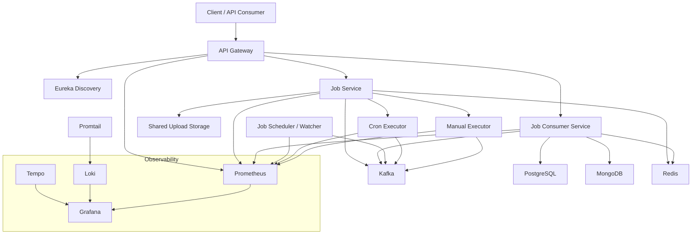
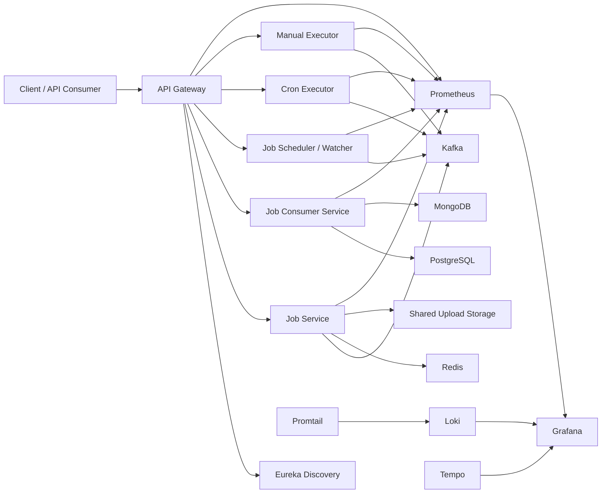
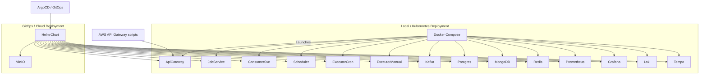

# 🛠️ Job Scheduler & Executor Platform

A **Java Spring Boot microservices platform** for scheduling, executing, tracking, and managing jobs with dependency resolution, retry handling, and multi-environment deployment support.

The project combines:
- Spring Cloud Gateway for API routing and resilience
- Eureka service discovery and Spring Cloud Config
- Kafka for event-driven execution
- PostgreSQL, MongoDB, Redis for persistence and caching
- Docker Compose and Kubernetes deployment packs
- Jenkins and SonarQube example CI/CD pipelines
- AWS API Gateway automation scripts for API lifecycle management

---

## 📌 Key Capabilities

- **Job orchestration** for one-time, scheduled, and dependency-based workflows
- **Distributed execution** via cron-style and manual executor services
- **Payload upload handling** with file persistence
- **Dependency tracking** using MongoDB-backed tracker entities
- **Service resilience** using gateway retries, circuit breakers, and health checks
- **Observability** via Prometheus, Grafana, Loki, Tempo
- **Multiple deployment options**: Docker Compose, Kubernetes Helm, Kustomize

---

## 🧱 System Architecture



---

## 📦 Core Components

1. **API Gateway** (`Api Gateway/ApiGateway`)
   - Spring Cloud Gateway
   - Routes traffic to `JobService` and `JobConsumerSvc`
   - Provides resilience with retry and circuit breaker patterns

2. **Service Discovery** (`Service Discovery/ServiceDiscovery`)
   - Eureka server for dynamic service registry

3. **Config Server** (`Config Server/ConfigServer`)
   - Centralized Spring Cloud Config
   - Loads shared configuration across services

4. **Job Service** (`Job Management/JobService`)
   - Job creation, modification, cancellation
   - Payload upload and management
   - Cancel request management

5. **Job Consumer Service** (`Job Management/JobConsumerSvc`)
   - Job and payload read/query APIs
   - Dependency tracker CRUD and search
   - Job run and cache management

6. **Job Scheduler / Watcher** (`Job Scheduling/watcher`)
   - Schedules job execution events
   - Works with Kafka and service discovery

7. **Executors**
   - Cron executor (`Job Execution/executor1`)
   - Manual executor (`Job Execution/executor1 - Manual`)
   - Executes jobs and runs Jenkinsfile-based pipelines where configured

8. **Infrastructure**
   - Kafka, PostgreSQL, MongoDB, Redis
   - Monitoring stack: Prometheus, Grafana, Loki, Tempo, Promtail

---

## 🎯 Functional Requirements

- Create jobs with schedules, payloads, dependencies, and retry policies
- Modify and cancel jobs through REST endpoints
- Upload payload files and store them on shared upload storage
- Track job execution state, dependencies, and task results
- Query jobs by ID, latest submission, dependency relationship, or status
- Manage job cancellation requests and persistence
- Support API gateway routing with fallback endpoints

---

## ⚙️ Non-Functional Requirements

- Highly available microservice architecture with service discovery
- Fault tolerance using retries and circuit breakers
- Observability for metrics, logs, and distributed tracing
- Deployment automation using Docker and Kubernetes
- CI/CD integration with Jenkins and SonarQube examples
- Modular service design for easier scaling and replacement
- Configurable environment settings through Spring Cloud Config

---

## 🧾 Domain Entities

### Job
- `id`, `jobSeqId`, `name`
- `scheduleType`, `cronExpression`, `scheduleTime`
- `status`, `retries`
- `dependencies`
- `payloads`
- `email`, `meta`, `modifiedTime`

### Payload
- `jobId`, `name`, `seqId`
- `status`, `startTime`, `endTime`
- `executorId`, `attemptNumber`, `errorMsg`
- `path` (file upload location)

### Cancel Request (`CancelReq`)
- `id`, `name`, `type`

### Dependency Tracker (`DepTracker`)
- `jobId`, `status`, `dependencies`
- `retry counts`, `scheduleTimes`, `executorId`, `error message`

### Job Run / Cache
- records execution progress, status, and history
- supports patch/update operations for live job state

---

## 🚪 Public APIs

### Job Service
- `POST /jobs` – create job
- `POST /jobs/modify/{jobId}` – modify existing job
- `DELETE /jobs/delete/{jobId}` – cancel job
- `POST /payloads/{jobId}` – upload payload for job
- `POST /payloads/modify/{payloadId}` – modify payload metadata
- `DELETE /payloads/delete/{payloadId}` – delete payload
- `POST /cancel` – create or update cancel request
- `GET /cancel/{id}` – fetch cancel request by ID
- `GET /cancel/name/{name}` – fetch cancel request by name

### Job Consumer Service
- `GET /jobs/jobsvc` – list jobs
- `GET /jobs/jobsvc/{jobId}` – get job by ID
- `GET /jobs/jobsvc/payload/{id}` – get job with payloads
- `GET /jobs/jobsvc/latest` – get latest job
- `PATCH /jobs/jobsvc/{jobId}` – modify job
- `GET /jobs/jobsvc/dependency/{dependency}` – jobs by dependency
- `POST /api/deptracker` – create dependency tracker
- `PATCH /api/deptracker/{id}` – update dependency tracker
- `DELETE /api/deptracker/{id}` – delete dependency tracker
- `GET /api/deptracker` – list all trackers
- `GET /api/deptracker/{id}` – get tracker by ID
- `GET /api/deptracker/job/{jobId}` – get trackers by job ID
- `GET /api/deptracker/status/{status}` – get trackers by status
- `GET /api/deptracker/executor/{executorId}` – get trackers by executor
- `GET /api/deptracker/dependency/{dependencyId}` – get trackers by dependency
- `GET /api/deptracker/search?name=...` – search trackers by name

---

## 🏗️ High-Level Architecture (HLD)

- **User / client** interacts with the API Gateway
- **API Gateway** routes requests to backend services and handles resilience
- **Service Discovery** provides dynamic registration and lookup
- **Config Server** centralizes environment and runtime configuration
- **Job Service** owns write operations and job lifecycle events
- **Job Consumer Service** supports read/query operations and dependency tracking
- **Scheduler / Watcher** emits execution events, potentially on cron schedule
- **Executors** perform actual job execution based on Kafka events
- **Data services** hold durable state and metadata
- **Observability stack** collects telemetry and logs



---

## 🧠 Low-Level Architecture (LLD)

- **Spring Boot applications** each use their own Maven module
- **Gateway routes** are configured in `Api Gateway/ApiGateway/src/main/resources/application.properties`
- **Eureka clients** connect over `http://discovery-service:8090/eureka/`
- **Config import** from `http://CONFIG-SERVER:8092`
- **Kafka** is used for event passing across services and executors
- **Redis** is used for caching and request-rate limiting
- **MongoDB** is used for dependency and job tracker storage
- **PostgreSQL** is used for job persistence and history
- **File uploads** are stored under `/data/uploads` in Docker volumes
- **Executors** may process Jenkinsfile pipelines and external tooling commands

---

## 🚀 Deployment Options

### Deployment Architecture



### 1. Docker Compose

Local orchestration is available in:
- `deployment/docker-compose/docker-compose.yml`
- `deployment/docker-compose/apps.yml`
- `deployment/docker-compose/monitoring.yml`

Start the full stack:

```bash
cd "d:/lap/AWS-Docker/Job-Scheduler-Executor/deployment/docker-compose"
docker compose -f apps.yml -f monitoring.yml up -d
```

Stop the stack:

```bash
docker compose -f apps.yml -f monitoring.yml down
```

### 2. Kubernetes Helm

Helm deployment is documented in:
- `deployment/kubernetes-helm/kubernetes-readme.md`

Use this package for local Kubernetes deployment with namespaces, ingress, observability, and storage.

### 3. Kubernetes Kustomize

Kustomize deployment is documented in:
- `deployment/kubernetes-Kustomize/README.md`

This layout supports local cluster overlays, app manifests, and environment-specific customization.

### 4. AWS API Gateway

The repo includes AWS API Gateway automation scripts in `aws/apigateway` to create APIs, resources, methods, integrations, deployments, API keys, and usage plans.

These scripts are currently written for LocalStack-style endpoint configuration using `AWS_ENDPOINT=http://localhost:4566`.

---

## 🛠️ DevOps & CI/CD

### Jenkins

The repository contains multiple Jenkins pipeline examples, including:
- `examples/Jenkinsfile.enterprise`
- `examples/Jenkinsfile.advance`
- `examples/Jenkinsfile.springboot`

These examples demonstrate:
- source checkout and versioning
- Maven build and test stages
- SonarQube static analysis
- dependency and security scanning
- Docker image build and push
- staging/prod deployment steps
- Helm deployments
- rollback and notification logic

### SonarQube

SonarQube is referenced in Jenkins examples for code quality gating and quality gate enforcement. Example pipeline steps include:
- `mvn sonar:sonar`
- `withSonarQubeEnv('SonarQube')`
- `-Dsonar.qualitygate.wait=true`

### Docker image publishing

`push-images.sh` builds and pushes Docker images for all core modules using Docker Hub credentials. It includes image names such as:
- `job-apigateway`
- `job-configserver`
- `job-servicediscovery`
- `job-service`
- `job-consumersvc`
- `job-schedulersvc`
- `job-cronexecutor`
- `job-manualexecutor`

### AWS / Cloud Integration

- Includes AWS CLI automation scripts for API Gateway resource creation and deployment.
- Scripts create REST APIs, resources, methods, integrations, deployments, API keys, and usage plans.
- Designed for LocalStack compatibility by using `--endpoint-url $AWS_ENDPOINT`.

### ArgoCD

ArgoCD is referenced as a supported deployment/service integration in executor environment configuration, and the Kubernetes deployment manifests are suitable for GitOps-driven rollout patterns.

---

## ✅ Run Locally

### Prerequisites

- Docker & Docker Compose
- Java 17+ and Maven
- Kubernetes cluster for Helm/Kustomize deployments (optional)
- LocalStack if using the AWS API Gateway scripts
- Optional: Jenkins, SonarQube, Prometheus/Grafana for CI/CD and monitoring

### Quick start with Docker Compose

```bash
cd "d:/lap/AWS-Docker/Job-Scheduler-Executor/deployment/docker-compose"
docker compose -f apps.yml -f monitoring.yml up -d
```

### Accessing services

- API Gateway: `http://localhost:8091`
- Job Service: `http://localhost:8081`
- Job Consumer Service: `http://localhost:8082`
- Job Scheduler: `http://localhost:8083`
- Executor Cron: `http://localhost:8084`
- Executor Manual: `http://localhost:8085`
- Eureka Discovery: `http://localhost:8090`
- Config Server: `http://localhost:8092`
- Grafana: `http://localhost:3000`
- Prometheus: `http://localhost:9090`

---

## 📁 Relevant Files & Documentation

- `deployment/docker-compose/docker-compose.yml`
- `deployment/docker-compose/apps.yml`
- `deployment/docker-compose/monitoring.yml`
- `deployment/kubernetes-helm/kubernetes-readme.md`
- `deployment/kubernetes-Kustomize/README.md`
- `aws/apigateway` scripts
- `examples/Jenkinsfile.enterprise`
- `examples/Jenkinsfile.advance`
- `examples/Jenkinsfile.springboot`
- `push-images.sh`

---

## 📌 Notes

- The API Gateway route configuration is currently commented in `Api Gateway/ApiGateway/src/main/resources/application.properties`.
- The scheduler is designed to run as a single active instance by default to avoid duplicate triggers.
- File uploads are persisted under `/data/uploads` and can be shared across containers using Docker volumes.
- Service names and ports are defined in the Docker Compose manifests and should align with the Spring Cloud service IDs.

---

## 📬 Contribution & Support

The platform is intended as a foundation for job orchestration, workflow execution, and DevOps automation. Contributions are welcome for:
- expanding API coverage
- adding runtime tests and readiness checks
- improving cloud-native deployment manifests
- full GitOps / ArgoCD pipeline automation
- stronger security and secrets management

For changes, update existing deployment docs and pipeline examples so the root README remains a central reference.

