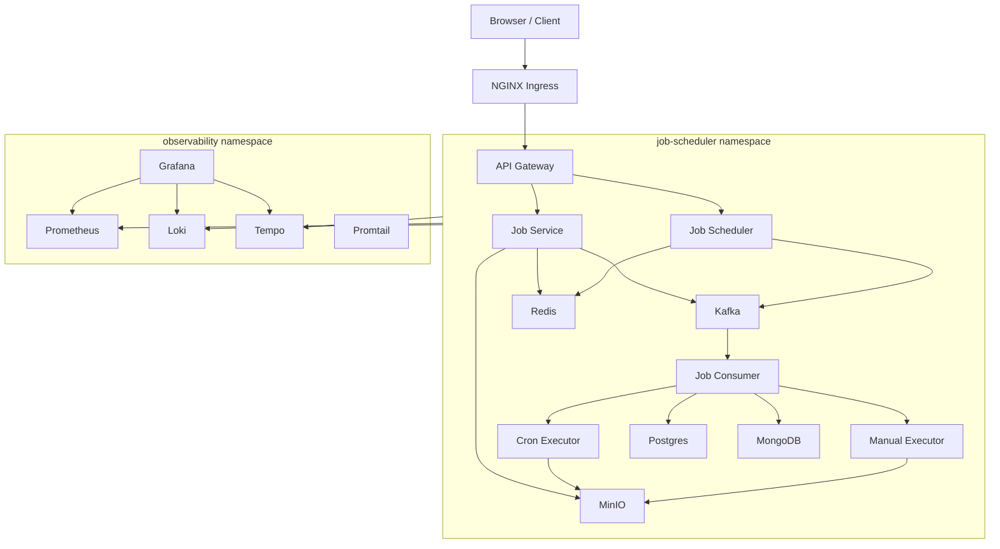

# Kubernetes Enterprise-Free Architecture

This directory is a new Kubernetes deployment layout for the Job Scheduling and Execution project. It does not modify the existing `deployment/newK8s` files.

The goal is to practice a big-company style architecture using free/local technology:

- Docker Desktop Kubernetes, kind, k3d, or minikube
- NGINX Ingress instead of a cloud load balancer
- MinIO instead of S3
- Local Postgres, MongoDB, Redis, and Kafka instead of managed cloud services
- Prometheus, Grafana, Loki, Promtail, and Tempo for observability
- Kustomize overlays for environment separation

## Directory Model

```text
kubernetes-enterprise-free/
  base/
    namespaces/
    ingress/
    apps/
    data/
    observability/
    policies/
  overlays/
    dev/
```

## Apply Locally

Install NGINX Ingress first if your cluster does not already have it.

For Docker Desktop or kind:

```bash
kubectl apply -k deployment/kubernetes-enterprise-free/overlays/dev
```

Check rollout:

```bash
kubectl get pods -A
kubectl get svc -A
kubectl rollout status deployment/api-gateway -n job-scheduler
```

Port-forward the gateway if you do not install ingress:

```bash
kubectl port-forward svc/api-gateway 8091:8091 -n job-scheduler
```

## Architecture



## No-Downtime Defaults

Every stateless app uses:

- `replicas: 2` or more, except scheduler by default
- `RollingUpdate` with `maxUnavailable: 0`
- readiness and liveness probes
- CPU and memory requests so HPA works
- PodDisruptionBudgets
- preferred pod anti-affinity so replicas spread when multiple nodes exist
- immutable image tags in the overlay

## Important Notes

The scheduler is set to one replica by default because duplicate scheduler pods can create duplicate job triggers. To scale it safely, add leader election or a distributed lock with Redis/Postgres.

The old `hostPath` upload pattern is replaced with MinIO. Application code may need to support S3-compatible storage variables before uploads fully move away from local disk.

For a stronger local distributed setup, use kind or k3d with multiple worker nodes instead of single-node Docker Desktop.
