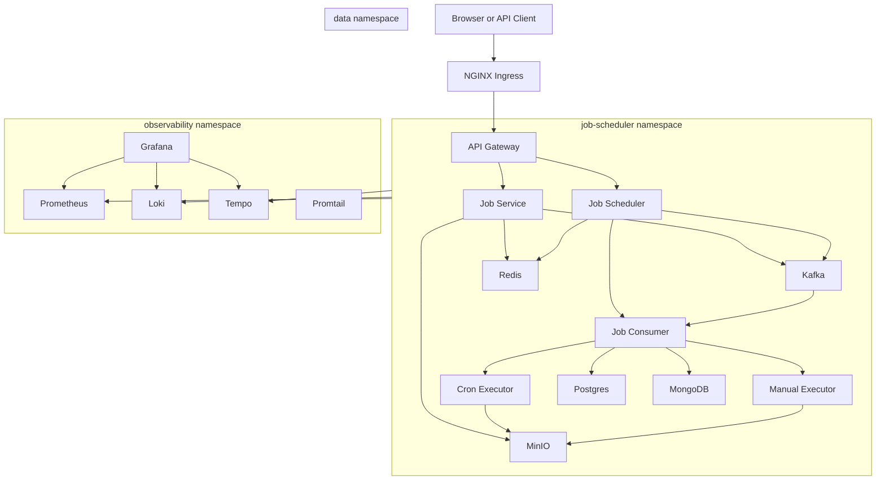

# Kubernetes Helm Platform

This folder is a new Helm-based deployment package for the Job Scheduling and Execution platform. It references the architecture from `deployment/kubernetes-enterprise-free` but does not update or replace that older Kustomize layout.

## Folder Layout

```text
deployment/kubernetes-helm-platform/
  chart/
    Chart.yaml
    values.yaml
    values-dev.yaml
    templates/
      apps/
        api-gateway.yaml
        job-service.yaml
        job-consumer.yaml
        job-scheduler.yaml
        job-cron-executor.yaml
        job-manual-executor.yaml
      data/
        postgres.yaml
        mongodb.yaml
        redis.yaml
        kafka.yaml
        minio.yaml
      observability/
        grafana.yaml
        prometheus.yaml
        loki.yaml
        promtail.yaml
        tempo.yaml
      ingress/
        ingress.yaml
      policies/
        app-pdb.yaml
  scripts/
```

## Architecture



## Quick Start

Run these commands from the repository root.

Render the Helm chart without applying it:

```bat
deployment\kubernetes-helm-platform\scripts\render-dev.bat
```

Install or upgrade the local dev release:

```bat
deployment\kubernetes-helm-platform\scripts\install-dev.bat
```

Check platform status:

```bat
deployment\kubernetes-helm-platform\scripts\status-dev.bat
```

Port-forward the API Gateway:

```bat
deployment\kubernetes-helm-platform\scripts\port-forward-api.bat
```

Port-forward Grafana:

```bat
deployment\kubernetes-helm-platform\scripts\port-forward-grafana.bat
```

Uninstall the release:

```bat
deployment\kubernetes-helm-platform\scripts\uninstall-dev.bat
```

## Direct Helm Commands

```bat
helm template job-platform deployment\kubernetes-helm-platform\chart -f deployment\kubernetes-helm-platform\chart\values-dev.yaml
helm upgrade --install job-platform deployment\kubernetes-helm-platform\chart -f deployment\kubernetes-helm-platform\chart\values-dev.yaml --wait --timeout 15m
helm status job-platform
helm uninstall job-platform
```

## Local Dev Defaults

`values-dev.yaml` keeps the same local development intent as the previous dev overlay:

- Ingress host is `jobs.local`.
- Storage class is `hostpath`.
- PVC sizes are smaller for local clusters.
- Grafana uses NodePort `32000`.
- App images use the `1.0.0` tags defined in `values.yaml`.

If your local cluster does not have a `hostpath` storage class, change `storageClassName` in `values-dev.yaml` to your cluster storage class, or set it to an empty string to use the default StorageClass.

## Namespaces

The chart creates these namespaces by default:

- `job-scheduler` for Spring services, ingress, HPAs, and PDBs.
- `data` for Postgres, MongoDB, Redis, Kafka, and MinIO.
- `observability` for Prometheus, Grafana, Loki, Promtail, and Tempo.

Set `namespaces.create=false` if your cluster manages namespaces separately.

## Service Notes

API Gateway is the public application entrypoint on service port `8091`.

Job Scheduler remains at one replica by default. Scaling it can create duplicate scheduled triggers unless the application adds leader election or a distributed lock.

MinIO replaces local upload storage and exposes app credentials through `minio-app-secret` in the `job-scheduler` namespace.

Prometheus scrapes Spring actuator metrics from pods in the `job-scheduler` namespace. Promtail ships pod logs to Loki, and Tempo accepts Zipkin traces on port `9411`.
